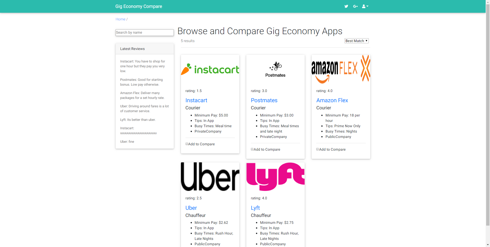

Who uses it?

People looking to see what gig economy app to apply to
What data will it be displaying to the user?

The different types of gig economy apps and the data about a pay  and scheduling and a rating.

People can rate the gig app and leave comments on each gigs page.
What data will the app have to gather from the user?

The app will gather reviews from the user and ask them to create an account.

A list of technologies that you plan to use (in addition to React and Spring Boot)

PostgreSql 

A well-defined and written-out prioritized feature list
Different pages
i.	Show all gigs
ii.	 Comparison Screen
iii.	Show single gig and their reviews

A list of user stories for every view and any functionality that exists within that view

•	As a user, I can see all of the gigs with the name, logo, min money per job, needed tools, ratings and the place jobs are located at in a card. 
•	I can filter the gigs with a search bar. 
•	I can filter the gigs with filter bar.
•	I can filter the gigs
•	Header with left side logo right side user log/in
•	Footer with 
•	As a user, I can add a gig to the comparison tool by clicking the "compare" button.

Single Gig View
•	As a user, when I click one of gigs in the list, I am taken to a page that shows me the full details about that gig and reviews.
•	As a user, when I click the add a comment button, it takes me to a form that allows me to add a reviews to the list.
•	As a user, I am able to remove my review from this list by clicking the delete button next to the comment.
Comparison View

•	As a user, I can see the gig logo and summary
•	As a user, I see a table with the two gigs lined up with comparative stats
•	I can add two gigs to the comparison tool.
•	Where to apply
